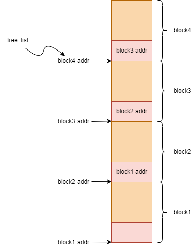
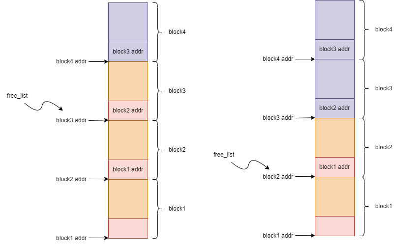
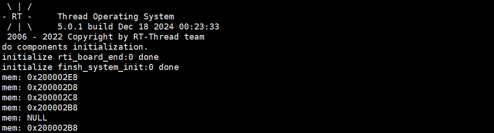
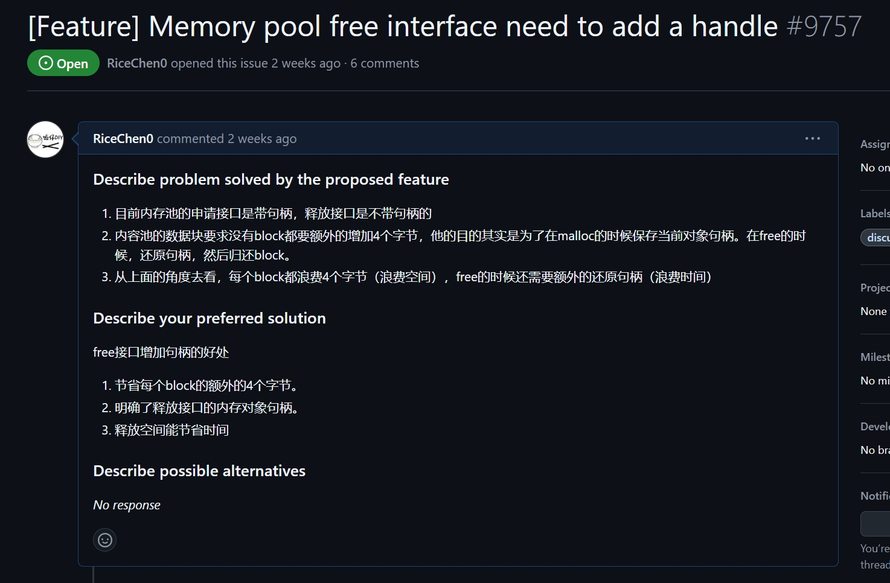

# RMP
RMP(Rice Memory Pool)全称内存池，它是超级高效，并且线程安全的内存池组件。 

## RMP背景

##### RMP设计初衷
1. 动态申请内存的长度相近，并且申请次数频繁，期望有一个高效却合理处理内存分配和释放的软件组件。
2. 第一点的场景在RTOS环境中，期望有一个满足线程安全的内存分配和释放的软件组件。

##### RMP特点
1. 效率性：提供一个高效分配的内存分配算法。
2. 安全性：针对RTOS环境，提供线程安全的内存分配方式。
3. 跨平台性：支持任意的RTOS环境，裸机环境。
4. 资源损耗：几乎可以忽略RAM和ROM的消耗。
5. 模式支持：支持静态模式和动态模式。
6. 通信方式：支持阻塞方式和非阻塞方式。

##### 应用场景
1. 场景1：在一些协议设计场景中，且协议报文长度相近
    - 处理方式1：采用动态内存申请分配协议报文存储空间。存在问题：反复的内存申请释放，会导致内存碎片。
    - 处理方式2：采用一个大内存，用户拆成多个块，自行管理。存在问题：增加代码的复杂度。

2. 场景2：在RTOS环境中，邮箱的传输过程，邮箱指传输报文的起始地址，它不像消息队列一样内部实现会做数据拷贝。所以需要防护传输报文的内存。
    - 处理方式1：在邮箱发送线程申请报文内存，在邮箱接收线程释放报文内存。存在问题：反复的内存申请释放，会导致内存碎片。
    - 处理方式2：采用一个大内存，用户拆成多个块，自行管理，在邮箱发送线程获取内存块，在邮箱接收线程释放内存块。存在问题：增加代码的复杂度。
    - 处理方式3：如果你使用的系统是RT-RThread，可以利用RT-Thread的内核对象--内存池，大部分系统没有提供该机制。

## RMP软件设计

##### RMP初始化框图



##### RMP初始化软件设计说明

1. RMP的设计是将一个大的内存块平均划分为多个大小相同的内存块。
2. 通过下一个内存的起始4个字节保存上一个内存块的地址起始地址。
3. 最后一个内存块的起始地址，通过一个free_list保存。这样就可以形成一个链式存储。
4. 这种方式可以通过free_list快速的查找到任意的内存块。

##### RMP内存申请框图



##### RMP内存申请软件设计说明

1. 当内存块申请的时候，通过block4的前4个字节找到block3的起始地址。
2. free_list保存block3的起始地址。
3. 返回block3的起始地址。
4. 这时内存池将减少一内存块。
5. 以此类推。

##### RMP内存释放框图


##### RMP内存释放软件设计说明
1. 当block2释放的时候，block2的前四个字节保存free_list指向的地址。
2. free_list保存block2的起始地址。
3. 这是内存池将增加一个内存块。
4. 以此类推。


##### RMP目录结构

```C
├─adapter
│  └─rtthread                   
│      ├─rmp_mutex.c            // rtthread mutex适配层
│      └─rmp_sem.c              // rtthread sem适配层
├─example                       
│  └─rmp_rtt_example.c          // rtthread 平台实例
├─include
│  ├─rmp_def.h                  // rmp 通用接口定义
│  └─rmp.h                      // rmp 对外头文件
└─src
   └─rmp.c                      // rmp 核心代码源文件
```

## RMP接口说明

| 接口 | 说明 |
|------|------|
| rmp_create | 动态创建内存池 |
| rmp_delete | 删除动态创建的内存池 |
| rmp_init | 内存池初始化 |
| rmp_deinit | 内存池去初始化 |
| rmp_alloc | 阻塞方式从内存池申请内存块 |
| rmp_try_alloc | 非阻塞方式从内存池申请内存块 |
| rmp_free | 释放内存块 |
| rmp_available | 内存池剩余内存块个数 |

- 动态创建内存池
    - 根据单个内存块的大小和内存块个数，申请内存池。
    - 内存池的空间通过malloc方式申请

``` C
mp_t *rmp_create(uint32_t size, uint32_t count);
```

|**参数**|**描述**|
|------|------|
| size | -- |
| count | -- |
|**返回**| ——  |
| mp | 创建成功，返回内存池句柄 |
| NULL | 创建失败 |

- 删除动态创建的内存池
    - 内存池的空间通过free方式释放。

``` C
void rmp_delete(rmp_t *mp);
```

|**参数**|**描述**|
|------|------|
| mp | 内存池句柄 |
|**返回**| ——  |
| - |  |

- 内存池初始化
    - 内存池的空间由用户提供。
    - 告知内存池单个内存块的大小和内存块个数

``` C
void rmp_init(rmp_t *mp, void *mem, uint32_t size, uint32_t count);
```

|**参数**|**描述**|
|------|------|
| mp | 内存池句柄 |
| mem | 指向内存池的指针，由用户提供 |
| size | 单个内存块的大小 |
| count | 内存块个数 |
|**返回**| ——  |
| - |  |

- 内存池去初始化
``` C
void rmp_deinit(rmp_t *mp);
```

|**参数**|**描述**|
|------|------|
| mp | 内存池句柄 |
|**返回**| ——  |
| - |  |

- 阻塞方式从内存池申请内存块
    - 在RTOS环境，它是阻塞方式从内存池申请内存块
    - 在非RTOS环境，它是非阻塞方式从内存池申请内存块

``` C
void *rmp_alloc(rmp_t *mp);
```

|**参数**|**描述**|
|------|------|
| mp | 内存池句柄 |
|**返回**| ——  |
| mem | 申请到内存块 |
| NULL | 申请不到内存块 |

- 非阻塞方式从内存池申请内存块
    - 在RTOS环境，它是非阻塞方式从内存池申请内存块
    - 在非RTOS环境，它和rmp_alloc功能一样。它是非阻塞方式从内存池申请内存块。

``` C
void *rmp_try_alloc(rmp_t *mp);
```

|**参数**|**描述**|
|------|------|
| mp | 内存池句柄 |
|**返回**| ——  |
| mem | 申请到内存块 |
| NULL | 申请不到内存块 |

- 释放内存块
    - 在RTOS环境，它是阻塞方式从内存池申请内存块
    - 在非RTOS环境，它是非阻塞方式从内存池申请内存块

``` C
void rmp_free(rmp_t *mp, void *ptr);
```

|**参数**|**描述**|
|------|------|
| mp | 内存池句柄 |
| ptr | 需要释放的内存块 |
|**返回**| ——  |
| - |  |

- 内存池中可用内存块剩余个数

``` C
uint32_t rmp_available(rmp_t *mp);
```

|**参数**|**描述**|
|------|------|
| mp | 内存池句柄 |
|**返回**| ——  |
| num | 内存块剩余个数 |

## RMP验证
实验说明：分别通过静态和动态定义一个内存池，内存池大小为（16 * 4），每个内存块为16，一共4块。连续申请5块，再释放第4块，再申请一块。

1. 静态内存池方式：

``` C
#include "rmp.h"

int rmp_init(void)
{
    uint8_t buff[16 * 4];
    rmp_t mp;
    
    rmp_init(&mp, buff, 16, 4);

    void *mem1 = rmp_try_alloc(&mp);
    if (mem1 != NULL)
        rt_kprintf("mem: 0x%08X\n", (int)mem1);
    else
        rt_kprintf("mem: NULL\n");

    void *mem2 = rmp_try_alloc(&mp);
    if (mem2 != NULL)
        rt_kprintf("mem: 0x%08X\n", (int)mem2);
    else
        rt_kprintf("mem: NULL\n");

    void *mem3 = rmp_try_alloc(&mp);
    if (mem3 != NULL)
        rt_kprintf("mem: 0x%08X\n", (int)mem3);
    else
        rt_kprintf("mem: NULL\n");

    void *mem4 = rmp_try_alloc(&mp);
    if (mem4 != NULL)
        rt_kprintf("mem: 0x%08X\n", (int)mem4);
    else
        rt_kprintf("mem: NULL\n");

    void *mem5 = rmp_try_alloc(&mp);
    if (mem5 != NULL)
        rt_kprintf("mem: 0x%08X\n", (int)mem5);
    else
        rt_kprintf("mem: NULL\n");

    rmp_free(&mp, mem4);

    void *mem6 = rmp_try_alloc(&mp);
    if (mem6 != NULL)
        rt_kprintf("mem: 0x%08X\n", (int)mem6);
    else
        rt_kprintf("mem: NULL\n");
    return RT_EOK;
}
INIT_COMPONENT_EXPORT(rmp_init);
```

2. 动态内存池方式：

``` C
#include "rmp.h"

int rmp_init(void)
{
    rmp *mp = NULL;

    mp = rmp_create(16, 4);
    if (mp == NULL)
    {
        rt_kprintf("rmp create failed\n");
        return -1;
    }

    void *mem1 = rmp_try_alloc(mp);
    if (mem1 != NULL)
        rt_kprintf("mem: 0x%08X\n", (int)mem1);
    else
        rt_kprintf("mem: NULL\n");

    void *mem2 = rmp_try_alloc(mp);
    if (mem2 != NULL)
        rt_kprintf("mem: 0x%08X\n", (int)mem2);
    else
        rt_kprintf("mem: NULL\n");

    void *mem3 = rmp_try_alloc(mp);
    if (mem3 != NULL)
        rt_kprintf("mem: 0x%08X\n", (int)mem3);
    else
        rt_kprintf("mem: NULL\n");

    void *mem4 = rmp_try_alloc(mp);
    if (mem4 != NULL)
        rt_kprintf("mem: 0x%08X\n", (int)mem4);
    else
        rt_kprintf("mem: NULL\n");

    void *mem5 = rmp_try_alloc(mp);
    if (mem5 != NULL)
        rt_kprintf("mem: 0x%08X\n", (int)mem5);
    else
        rt_kprintf("mem: NULL\n");

    rmp_free(&mp, mem4);

    void *mem6 = rmp_try_alloc(mp);
    if (mem6 != NULL)
        rt_kprintf("mem: 0x%08X\n", (int)mem6);
    else
        rt_kprintf("mem: NULL\n");
    
    return RT_EOK;
}
INIT_COMPONENT_EXPORT(rmp_init);
```

3. 实验运行结果：成功申请4次，失败1次，然后释放了1次，又可以申请1次。



## 总结：
1. rmp是一个非常高效且安全的内存池组件。
2. rmp可以减少对malloc和free的使用，避免内存碎片的产生。
3. 在设计rmp的同时，也发现RT-Thread内核自带的内存池是很浪费空间并且时间上不是最佳的，我也给RT-Thread社区提了一个对应的issue。


